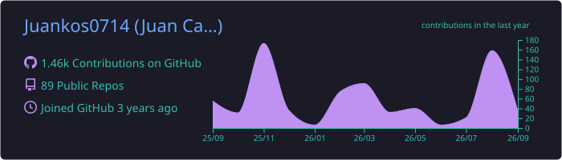
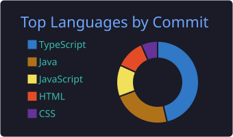
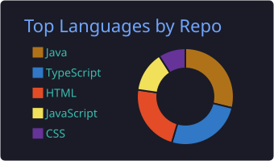
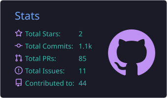
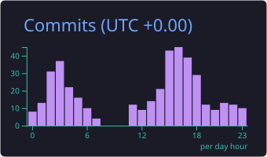

<h1 align="center">Hi, I'm Juan Camilo 👋</h1>

  <strong>Product Engineer · Full-Stack Developer</strong> 
  Building scalable products, reactive systems, and AI-powered applications.

  
  
  

---

### 🚀 About Me

I'm a Product Engineer / Full-Stack Developer who builds complete products end to end — from reactive Spring Boot microservices to modern Angular, React, and SvelteKit frontends. I care as much about **architecture and scalability** as about **how a feature actually feels** to the person using it.

- 💼 Professional experience as a **Product Engineer at Symmetry**
- 🏨 Building **[Ubik](https://github.com/ubik-back/ubik-backend)** — a reactive microservices platform for hotel & motel booking (Spring WebFlux + Angular + Azure)
- 🛵 Building **[Stargo](https://github.com/Juankos0714/Stargo)** — a food-delivery PWA live at [stargo-zeta.vercel.app](https://stargo-zeta.vercel.app) (SvelteKit + Supabase)
- 🧠 Focused on reactive programming, distributed systems, and AI-assisted development
- 🎓 Tecnólogo en Análisis y Desarrollo de Software — SENA (2024–2026)
- ⚡ Ship fast, measure, iterate — UX is part of engineering, not an afterthought

---

### 💼 Professional Experience

**Symmetry** — *Product Engineer*
Contributed as a Product Engineer, working hands-on across the stack on real product features. [`starter-project`](https://github.com/Juankos0714/starter-project) is the public applicant showcase associated with this experience.

---

### 🛠️ Tech Stack

**Languages**

  
  
  

**Backend**

  
  
  
  
  
  
  

**Frontend**

  
  
  
  
  
  
  

**Databases**

  
  
  
  
  

**Cloud & DevOps**

  
  
  
  
  
  

**Messaging & Integrations**

  
  
  
  
  

**Observability**

  
  
  

**AI**

  
  

---

### 🌟 Selected Projects

#### 🏨 [Ubik](https://github.com/ubik-back/ubik-backend) — Hotel & Motel Reservation Platform
Reactive microservices platform for motel/hotel search and booking, deployed on Azure.
- **Architecture:** 7 reactive microservices (Spring WebFlux) — Gateway, User Management, Motel Management, Notifications, Payments, Streaks, AI Service
- **Frontend:** Angular with SSR, signal-based state, glassmorphism UI, light/dark theming
- **Infra:** Docker Compose · Azure VM · Nginx + SSL (Let's Encrypt) · systemd
- **Integrations:** Stripe (payments + webhooks) · RabbitMQ (async events) · Ollama (local LLM) · Prometheus + Grafana + Loki
- **Patterns:** Hexagonal architecture · Reactive programming (`Mono`/`Flux`) · Event-driven communication · RBAC (USER / OWNER / ADMIN)

#### 🏗️ [VentaDeLotes](https://github.com/Ingesoc/VentaDeLotes) — Real Estate Lot Sales Platform (Ingesoc)
Client product for "La Holanda," a rural lot-sales project in Quindío.
- React 19 · TypeScript · Vite · Tailwind CSS · shadcn/ui · Radix UI
- React Router · TanStack Query · React Hook Form · Zod · Framer Motion
- Interactive map (React Leaflet) with pixel-accurate lot markers, Recharts dashboards
- Backend-as-a-Service on Supabase: Auth, Storage, Realtime, Edge Functions, Row Level Security

#### 🛵 [Stargo](https://github.com/Juankos0714/Stargo) — Food Delivery PWA
Full delivery platform for Armenia, Quindío — live at [stargo-zeta.vercel.app](https://stargo-zeta.vercel.app).
- SvelteKit + Supabase, deployed as a PWA on Vercel
- Web Push notifications (VAPID + Service Worker)
- Neighborhood-to-zone fare calculation, Cloudinary + Supabase image pipeline

#### 🤖 [Nullbot](https://github.com/Juankos0714/Nullbot) — Automation & Admin Dashboard
Angular + TypeScript tooling for automation, service management, and admin dashboards.

#### 🧑‍💻 [Portfolio](https://github.com/Juankos0714/Portfolio)
Personal portfolio built with Next.js, TypeScript, and Tailwind CSS.

---

### 🏛️ Architecture & Engineering

- **Microservices** — service decomposition, API Gateway (Spring Cloud Gateway), inter-service communication
- **Reactive Programming** — non-blocking I/O with Spring WebFlux, Project Reactor (`Mono`/`Flux`), R2DBC
- **Hexagonal Architecture** — ports & adapters, domain/infrastructure separation
- **Event-Driven Systems** — async messaging with RabbitMQ, webhook-driven integrations (Stripe)
- **CI/CD** — GitHub Actions pipelines, Docker-based deployments

---

### 📊 GitHub Stats

  

  
  

  
  

---

### 🎓 Education

**Tecnólogo en Análisis y Desarrollo de Software** — SENA (2024–2026)

---

### 📫 Get in Touch

Open to collaboration on scalable products, distributed systems, and AI-driven applications — reach out via [LinkedIn](https://www.linkedin.com/in/juan-camilo-rojas-ospina-453793175/) or [email](mailto:juankos0714@gmail.com).
